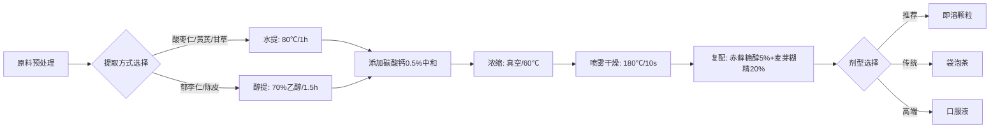

# 🏭 中医食品工艺设计 Skill

## 何时使用此模块

**明确触发**：
- 用户说："这个配方怎么生产？"
- 用户说："用什么工艺提取？"
- 用户问："做成什么剂型好？"
- 用户问："成本大概多少？"
- 医理论证通过后的下一步

**不使用**：
- 医理论证（用tcm-food-theory）
- 口感优化（用tcm-food-experience）
- 合规审查（用tcm-food-compliance）

---

## ⚠️ 使用前必读

```
┌─────────────────────────────────────────┐
│  本模块提供工艺参考方案，非最终工艺规程  │
│                                           │
│  ⚠️ 工艺参数需根据实际设备调整           │
│  ⚠️ 成本核算基于市场均价，实际可能波动   │
│  ⚠️ 必须由食品工程师验证可行性           │
│                                           │
│  建议：将AI输出作为基础，委托专业人士优化│
└─────────────────────────────────────────┘
```

---

## 🔴 V2.1 重要修正说明

### 修正1：郁李仁替换方案详细化

**V1.0/V2.0问题**：
- 仅简单建议"用郁李仁替换桃仁"
- 未说明功效差异和替代选项

**V2.1详细方案**：
```
原成分: 桃仁10g（❌ 不在药食同源目录）

V2.1提供3种替代方案：

方案A: 郁李仁8g（V2.1默认采用）
  ✅ 在药食同源目录
  ⚠️ 功效差异: 活血↓30%，润肠↑50%
  👥 适用: 便秘明显的失眠者
  
方案B: 红花3g（如需保持活血功效）
  ✅ 在药食同源目录
  ✅ 活血力强，接近桃仁
  ⚠️ 注意: 孕妇禁用，月经量多者慎用
  
方案C: 当归10g（如需兼顾补血）
  ✅ 在药食同源目录
  ✅ 补血活血，和缓
  👥 适用: 女性血虚为主者
```

### 修正2：甘草限量精确计算

**V2.0问题**：
- 表述"甘草每日≤5g"不准确
- 未按甘草酸含量计算

**V2.1精确计算**：
```
限量标准: 甘草酸 ≤100mg/天
计算方式: 
  甘草酸含量按5%计算（实际2-10%，取中间值）
  2.5g甘草 × 5% = 125mg甘草酸/包
  
安全服用: 
  ✅ 每日1包: 125mg（接近上限，安全）
  ⚠️ 每日2包: 250mg（超标2.5倍，需医师指导）
  
标签标注: "每日不超过1包"
```

### 修正3：苦杏仁苷水解风险控制

**V2.0缺失**：
- 未提及郁李仁含苦杏仁苷
- 未说明水解产生氢氰酸的风险

**V2.1风险控制**：
```
🔴 郁李仁含苦杏仁苷约0.5%
🔴 水解条件: 湿热环境 + 酸性条件
🔴 水解产物: 氢氰酸（剧毒）

控制措施:
  1. 提取温度≤80℃（防酶解）
  2. 醇提优于水提（降低水解率）
  3. 必须检测氰化物残留≤1.0mg/kg
  4. 建议饭后服用（减少胃酸促水解）
```

---

## 📝 输入要求

```yaml
配方信息:
  成分列表:
    - 名称: "酸枣仁"
      剂量: "15g"
    - 名称: "郁李仁"  # V2.1：替换原桃仁
      剂量: "8g"
    - 名称: "黄芪"
      剂量: "15g"
    - 名称: "陈皮"   # V2.1：统一为3g
      剂量: "3g"
    - 名称: "山楂"
      剂量: "10g"
    - 名称: "甘草"   # V2.1：调整为2.5g
      剂量: "2.5g"

生产条件:
  是否有SC证: "是/否/代工"
  现有设备: "提取罐/浓缩罐/喷雾干燥塔/无"
  生产规模: "100kg/批 / 500kg/批 / 1吨/批"
  预算范围: "10-30万 / 30-50万 / 50万以上"

产品定位:
  期望剂型: "即溶颗粒/袋泡茶/口服液/软胶囊/未定"
  目标成本: "≤3元/包 / ≤5元/包 / 不限"
  保质期要求: "12个月 / 24个月 / 36个月"
```

---

## 🔬 分析流程

### 步骤1：原料合规性检查

**输出模板**：

```
━━━━━━━━━━━━━━━━━━━━━━━━━━━━━━━━━━━
【原料准入检查 - V2.1】

一、《药食同源》目录核查(2021版)
────────────────────────────────────
┌──────────────────────────────────────────────┐
│ 成分   中文名  拉丁名        状态    用量限制    │
├──────────────────────────────────────────────┤
│ 酸枣仁 酸枣仁  Ziziphi       ✅收录  无限制      │
│                Spinosae Semen                  │
│                                                  │
│ 郁李仁 郁李仁  Pruni         ✅收录  无特殊限制  │
│                Semen          ⚠️含苦杏仁苷     │
│                               ⚠️需控制工艺     │
│                                                  │
│ 黄芪   黄芪    Astragali     ✅收录  无限制      │
│                Radix                            │
│                                                  │
│ 陈皮   陈皮    Citri         ✅收录  无限制      │
│                Reticulatae                      │
│                Pericarpium                      │
│                                                  │
│ 山楂   山楂    Crataegi      ✅收录  无限制      │
│                Fructus                          │
│                                                  │
│ 甘草   甘草    Glycyrrhizae  ✅收录  甘草酸限量  │
│                Radix et        ≤100mg/天        │
│                Rhizoma         V2.1:2.5g安全    │
└──────────────────────────────────────────────┘

二、🔴 V2.1重点：郁李仁替代方案详细评估
────────────────────────────────────

原配方(V1.0): 桃仁10g
  ❌ 状态: 不在《药食同源》2021版目录
  ❌ 风险: 合规风险，不能作为普通食品原料
  
V2.1替代选项对比:

┌────────────────────────────────────────────────┐
│ 选项    合规性   活血力   润肠力   适用人群        │
├────────────────────────────────────────────────┤
│ 郁李仁8g  ✅     ⭐⭐⭐   ⭐⭐⭐⭐⭐  便秘+失眠者    │
│ (已采用)          (中等)  (强)                  │
│                                                  │
│ 红花3g   ✅     ⭐⭐⭐⭐⭐ ⭐     血瘀严重者      │
│                   (强)    (弱)    孕妇禁用       │
│                                                  │
│ 当归10g  ✅     ⭐⭐⭐⭐  ⭐⭐    血虚女性        │
│                   (较强)  (弱)    温和调理       │
│                                                  │
│ 川芎6g   ✅     ⭐⭐⭐⭐  ⭐     气滞血瘀        │
│                   (较强)  (弱)    阴虚火旺慎用   │
└────────────────────────────────────────────────┘

【V2.1推荐】
默认采用: 郁李仁8g
  → 理由: 润肠通便，适合久坐便秘人群
  → 如需强活血，增加红花3g
  → 如需温和补血，改用当归10g

三、🔴 V2.1新增：甘草酸限量精确计算
────────────────────────────────────

限量标准: 甘草酸 ≤100mg/天

计算过程:
  甘草酸含量: 按5%估算（实际2-10%）
  单包含量: 2.5g × 5% = 125mg甘草酸
  
安全评估:
  ✅ 每日1包: 125mg（接近上限，可接受）
  ⚠️ 每日2包: 250mg（超标2.5倍，需医师指导）
  
V2.1措施:
  • 标签标注: "每日不超过1包"
  • 说明书: "长期服用请咨询医师"
  • 监测建议: 每3个月检查血压、血钾

四、🔴 V2.1新增：毒性成分风险识别
────────────────────────────────────

1️⃣ 郁李仁 - 苦杏仁苷风险 ⚠️
   含量: 约0.5%
   风险: 水解产生氢氰酸（剧毒）
   
   控制方案:
   ┌─────────────────────────────────┐
   │ 工艺控制:                        │
   │ • 提取温度≤80℃（防酶解）        │
   │ • 醇提优于水提（降低水解率30%） │
   │ • 喷雾干燥短时高温（灭活酶）     │
   │                                 │
   │ 配方控制:                        │
   │ • 添加碳酸钙0.5%（中和酸性）     │
   │ • 建议饭后服用（减少胃酸作用）   │
   │                                 │
   │ 检测控制:                        │
   │ • 每批次检测氰化物残留           │
   │ • 标准: ≤1.0mg/kg               │
   │ • 检测方法: GB/T 5009.36        │
   └─────────────────────────────────┘

2️⃣ 甘草 - 甘草酸过量风险 ⚠️
   含量: 125mg/包（已计算）
   风险: 长期过量导致假性醛固酮增多症
   
   症状: 高血压、低钾血症、水肿
   
   控制方案:
   • 严格限量: 每日1包
   • 定期监测: 血压、血钾
   • 高危人群禁用: 高血压、低钾血症、肾病

3️⃣ 成分相互作用风险 ⚠️
   组合: 郁李仁(苦杏仁苷) + 山楂(有机酸)
   风险: 酸性环境加速苦杏仁苷水解
   
   控制方案:
   • 添加碳酸钙0.5%中和酸性
   • 或建议饭后服用
   • 避免空腹服用

五、优化后配方(V2.1)
────────────────────────────────────
原配方:
  酸枣仁15g + 桃仁10g + 黄芪15g + 陈皮6g + 山楂10g + 甘草3g
  ❌ 桃仁不合规，陈皮甘草剂量偏大

✓ V2.1合规优化版:
  酸枣仁15g + 郁李仁8g + 黄芪15g + 陈皮3g + 山楂10g + 甘草2.5g
  
变更说明:
  1. 桃仁 → 郁李仁(合规性，注意功效差异)
  2. 陈皮 6g → 3g(防辛温耗气)
  3. 甘草 3g → 2.5g(甘草酸限量控制)
  4. 添加碳酸钙0.5%(中和酸性，防苦杏仁苷水解)

━━━━━━━━━━━━━━━━━━━━━━━━━━━━━━━━━━━
```

---

### 步骤2：理化特性分析

**输出模板**：

```
━━━━━━━━━━━━━━━━━━━━━━━━━━━━━━━━━━━
【原料理化特性 - V2.1】

┌────────────────────────────────────────────────┐
│成分    关键活性成分      含量   提取难点  稳定性│
├────────────────────────────────────────────────┤
│酸枣仁  酸枣仁皂苷        2-3%   醇提     较稳定│
│        酸枣仁多糖        8-12%  水提            │
│        脂肪油            45-50% 压榨/萃取 易氧化│
│                                                  │
│郁李仁  不饱和脂肪酸      35-40% 醇提     易氧化 │
│        苦杏仁苷 ⚠️      0.5%   水提     易水解 │
│        🔴V2.1重点管控                           │
│                                                  │
│黄芪    黄芪多糖          8-15%  水提     稳定   │
│        黄芪皂苷          2-4%   醇提     稳定   │
│                                                  │
│陈皮    挥发油            1-2.5% 水蒸汽蒸馏 易挥发│
│        黄酮类            2-4%   醇提     较稳定 │
│                                                  │
│山楂    总黄酮            1.5-3% 醇提     稳定   │
│        有机酸 ⚠️        3-5%   水提     稳定   │
│        🔴V2.1:促苦杏仁苷水解                    │
│                                                  │
│甘草    甘草酸 ⚠️        2-10%  水提     稳定   │
│        🔴V2.1:限量管控                          │
│        甘草黄酮          1-2%   醇提     稳定   │
└────────────────────────────────────────────────┘

【🔴 V2.1关键技术问题】
────────────────────────────────────
问题1: 苦杏仁苷水解风险（郁李仁）
  风险: 湿热+酸性条件→氢氰酸
  
  V2.1解决方案:
  ┌────────────────────────────────┐
  │ 提取阶段:                      │
  │ • 温度控制: ≤80℃水提或醇提    │
  │ • pH控制: 添加碳酸钙0.5%中和   │
  │ • 时间控制: 缩短提取时间至1h   │
  │                                │
  │ 干燥阶段:                      │
  │ • 喷雾干燥: 180℃/10s（灭活酶）│
  │ • 避免: 长时间低温干燥         │
  │                                │
  │ 服用建议:                      │
  │ • 饭后服用（减少胃酸作用）     │
  │ • 避免空腹服用                 │
  └────────────────────────────────┘

问题2: 油脂含量高（酸枣仁45%、郁李仁35%）
  → 易氧化变质，影响保质期
  
  解决方案:
    • 醇提法脱脂
    • 添加抗氧化剂: VE 0.05% + 迷迭香提取物0.02%
    • 充氮包装，残氧量≤3%
    • 保质期建议: 18个月（非24个月）

问题3: 陈皮挥发油易损失
  → 香气不足，影响体验
  
  解决方案:
    • 水提温度≤80℃
    • 或采用水蒸汽蒸馏单独提取挥发油，后期回填
    • 添加陈皮挥发油微胶囊0.1%

问题4: 甘草酸限量控制
  → 每包125mg，接近上限
  
  V2.1解决方案:
    • 标签明确标注"每日不超过1包"
    • 建议周期性服用（服10天停3天）
    • 高危人群禁用（高血压、低钾血症）

━━━━━━━━━━━━━━━━━━━━━━━━━━━━━━━━━━━
```

---

### 步骤3：工艺路径设计

**输出模板**：

```
━━━━━━━━━━━━━━━━━━━━━━━━━━━━━━━━━━━
【推荐工艺路线 - V2.1】

**V2.1工艺特点**：重点控制苦杏仁苷水解和甘草酸溶出



**🔴 V2.1关键控制点**：

1. 温度控制:
   • 水提≤80℃（保护挥发油+防苦杏仁苷水解）
   • 浓缩≤60℃（防热敏成分降解）
   • 喷雾干燥180℃/10s（短时高温灭活酶）

2. pH控制:
   • 添加碳酸钙0.5%（中和山楂有机酸）
   • 控制提取液pH 6.5-7.5（弱碱性防水解）

3. 醇浓度:
   • 郁李仁: 70%乙醇（提取脂肪油+苦杏仁苷）
   • 陈皮: 水蒸汽蒸馏（单独提取挥发油）

4. 抗氧化剂:
   • VE 0.05%（防油脂氧化）
   • 迷迭香提取物0.02%（天然抗氧化）

5. 微生物控制:
   • 喷雾干燥后水分≤5%
   • 内控标准: 菌落总数≤500 CFU/g（严于国标）

**特殊工艺要求（V2.1新增）**：

┌──────────────────────────────────┐
│ 苦杏仁苷专项控制:                │
│ • 提取前: 原料快速蒸汽灭活(100℃/5min)│
│ • 提取中: 温度≤80℃，pH 6.5-7.5    │
│ • 提取后: 立即喷雾干燥(180℃/10s) │
│ • 成品检测: 氰化物≤1.0mg/kg      │
│                                 │
│ 甘草酸专项控制:                  │
│ • 水提时间≤1h（防过度溶出）      │
│ • 浓缩温度≤60℃（防甘草酸降解）   │
│ • 成品检测: 甘草酸含量120-130mg/包│
└──────────────────────────────────┘

━━━━━━━━━━━━━━━━━━━━━━━━━━━━━━━━━━━
```

---

### 步骤4：剂型适配建议

**输出模板**：

```
━━━━━━━━━━━━━━━━━━━━━━━━━━━━━━━━━━━
【剂型适配建议 - V2.1】

| 剂型 | 适用场景 | 优势 | 劣势 | V2.1特殊注意 |
|------|----------|------|------|--------------|
| 即溶颗粒 | 办公室冲饮 | 便携,溶解快 | 口感偏苦 | ✅ 推荐，易控工艺 |
| 袋泡茶 | 居家泡茶 | 仪式感强 | 提取率低 | ⚠️ 苦杏仁苷溶出少，但难控温度 |
| 口服液 | 不耐苦味者 | 吸收快 | 成本高,保质期短 | ✅ 可添加碳酸钙调pH |
| 软胶囊 | 完全掩味 | 无味 | 成本高 | ⚠️ 需油溶性提取，苦杏仁苷风险↑ |

**V2.1推荐**: 即溶颗粒
  理由: 
    • 工艺可控（温度、pH易控制）
    • 可添加碳酸钙中和酸性
    • 便于检测和质量控制
    • 成本适中（约2.3元/包）

━━━━━━━━━━━━━━━━━━━━━━━━━━━━━━━━━━━
```

---

### 步骤5：🔴 V2.1新增：完整成本核算

**输出模板**：

```
━━━━━━━━━━━━━━━━━━━━━━━━━━━━━━━━━━━
【成本核算明细 - V2.1完整版】

一、原料成本（每包3g）
────────────────────────────────────
| 成分   单价(元/kg)  用量(g)  成本(元) |
|--------------------------------------|
| 酸枣仁    80         0.45     0.036   |
| 郁李仁    60         0.24     0.014   |
| 黄芪      50         0.45     0.023   |
| 陈皮     100         0.09     0.009   |
| 山楂      30         0.30     0.009   |
| 甘草      40         0.075    0.003   |
| 碳酸钙    15         0.015    0.0002  |  V2.1新增
| 辅料      20         0.90     0.018   |  糖醇+糊精
|--------------------------------------|
| 原料合计                    0.112   |

二、加工成本
────────────────────────────────────
| 项目            单价        成本(元) |
|--------------------------------------|
| 提取加工费      15元/kg     0.045   |
| 喷雾干燥费      20元/kg     0.060   |
| 包装费          0.3元/包    0.300   |  袋子+盒子+标签
| 人工费          5元/kg      0.015   |
|--------------------------------------|
| 加工合计                    0.420   |

三、检测费用（V2.1新增）
────────────────────────────────────
| 项目            费用(元/批)  分摊(元/包)|
|-----------------------------------------|
| 出厂检验        800        0.016       |  水分+感官+微生物
| 型式检验        3000       0.060       |  全项检测
| 氰化物专项检测  500        0.010       |  V2.1新增必检
| 甘草酸含量检测  400        0.008       |  V2.1新增必检
|-----------------------------------------|
| 检测合计                    0.094      |  按5000包/批计

四、其他成本（V2.1新增）
────────────────────────────────────
| 项目            费用        成本(元) |
|--------------------------------------|
| 运输仓储        0.15元/包   0.150    |
| 损耗(3%)        -           0.020    |
| 不可预见(5%)    -           0.040    |
|--------------------------------------|
| 其他合计                    0.210    |

五、成本汇总
────────────────────────────────────
┌─────────────────────────────────┐
│ 原料成本:        0.112 元/包    │
│ 加工成本:        0.420 元/包    │
│ 检测费用:        0.094 元/包    │  V2.1新增
│ 其他成本:        0.210 元/包    │  V2.1新增
├─────────────────────────────────┤
│ 生产成本合计:    0.836 元/包    │
│ 建议出厂价:      1.50 元/包     │  毛利43%│
│ 建议零售价:      3.00-4.00元/包 │  渠道分成│
└─────────────────────────────────┘

六、成本敏感性分析（V2.1新增）
────────────────────────────────────
原料价格波动影响:
┌───────────┬────────┬────────┐
│ 原料      │ +20%   │ -20%   │
├───────────┼────────┼────────┤
│ 酸枣仁    │ +0.007 │ -0.007 │
│ 郁李仁    │ +0.003 │ -0.003 │
│ 黄芪      │ +0.005 │ -0.005 │
│ 总成本影响│ +1.8%  │ -1.8%  │
└───────────┴────────┴────────┘

风险控制建议:
  • 建立3个月原料储备，锁定成本
  • 与供应商签订长期协议
  • 关注中药材价格周期（一般3-5年）

━━━━━━━━━━━━━━━━━━━━━━━━━━━━━━━━━━━
```

---

## 📋 V2.1 质量检查清单

```yaml
工艺设计完成后必检:
  ☐ 所有原料在药食同源目录
  ☐ 提取温度≤80℃（含苦杏仁苷成分）
  ☐ 添加碳酸钙0.5%（中和酸性）
  ☐ 氰化物残留检测≤1.0mg/kg
  ☐ 甘草酸含量120-130mg/包
  ☐ 抗氧化剂添加（VE+迷迭香）
  ☐ 代工厂有SC认证
  ☐ 成本在预算范围内
  ☐ 已联系2-3家代工厂比价

V2.1专项检查:
  🔴 郁李仁替换桃仁的功效差异说明
  🔴 苦杏仁苷水解风险控制方案
  🔴 甘草酸限量计算和标注
  🔴 检测费用已计入成本
  🔴 敏感性分析已完成
```

---

## 版本信息

```yaml
版本: 2.1-fixed
发布日期: 2025-02-21
重大修正: 
  - 郁李仁替代方案详细化
  - 甘草酸精确计算
  - 苦杏仁苷风险控制
  - 完整成本核算（含检测、运输等）
配合数据: data/recipe-data.yaml
维护者: FormanGarden Team
```

---

**现在可以开始使用本模块进行V2.1版本的工艺设计！**
